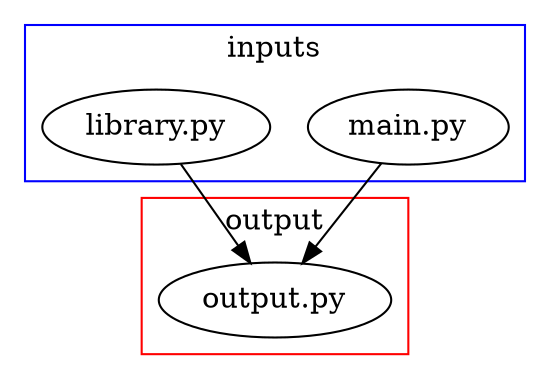

# singlue
A CLI tool to resolve function,class codes and integrate them to single file.

This program depends on `ast.unparse()`(added in `python3.9`).

## installation
```sh
pip install singlue
```

## example usage

```sh
singlue main.py > output.py
```

`singlue` generates `output.py` from `main.py`,`library.py`.




### `main.py`
```python
from library import one, two, Three


assert one() + two() == Three().three()
```

### `library.py`
```python
def one() -> int:
    return 1


def two() -> int:
    return 2


class Three:
    def __init__(self):
        self.value = 3

    def three(self):
        return self.value
```

### `output.py`
```python
def one() -> int:
    return 1
def two() -> int:
    return 2
class Three:

    def __init__(self):
        self.value = 3

    def three(self):
        return self.value
assert one() + two() == Three().three()
```
